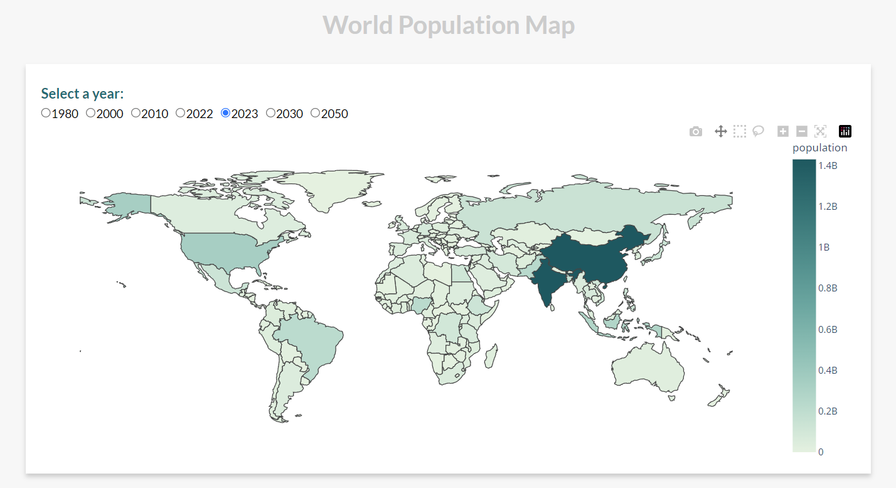

# World Population Dashboard

World Population Dashboard is a dashboard for visualizing and analyzing the world population data. The project is developed using Plotly Dash, a Python framework for building analytical web applications.

## Table of Contents

- [Installation](#installation)
- [Usage](#usage)
- [Features](#features)
- [License](#license)
- [Dataset](#dataset)
- [Screenshots](#screenshots)
- [Acknowledgments](#acknowledgments)

## Installation

1. Clone the repository.
   ```shell
   git clone https://github.com/zli9/dashboard.git
   ```

2. Navigate to the project directory.
   ```shell
   cd dashboard
   ```

3. Install the dependencies using pip.
   ```shell
   pip install -r requirements.txt
   ```

## Usage

1. Start the dashboard server.
   ```shell
   python dashboard/app.py
   ```

2. Open a web browser and go to `http://localhost:8050` to access the dashboard.

## Features

- Interactive visualization of world population map.
- Analyze population trends between 1980 and 2050.
- Compare population data between countries.

## License

This project is licensed under the [MIT License](https://opensource.org/licenses/MIT).

## Dataset

The dataset used for this project is the [Kaggle World Population by Country](https://www.kaggle.com/datasets/rajkumarpandey02/2023-world-population-by-country) dataset. It provides population estimates for various countries and regions around the world. Please refer to the dataset documentation for more information on its structure and usage.

## Screenshots



